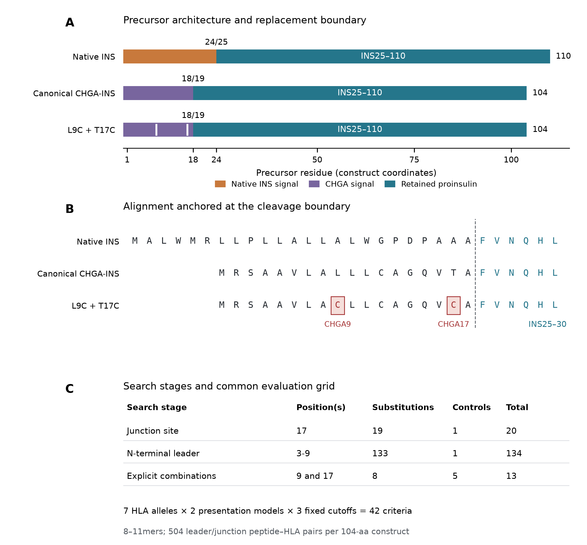
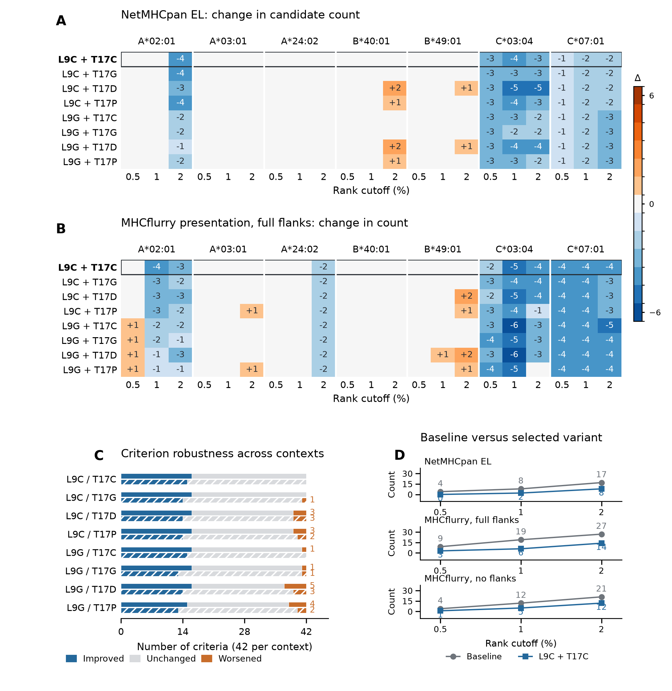
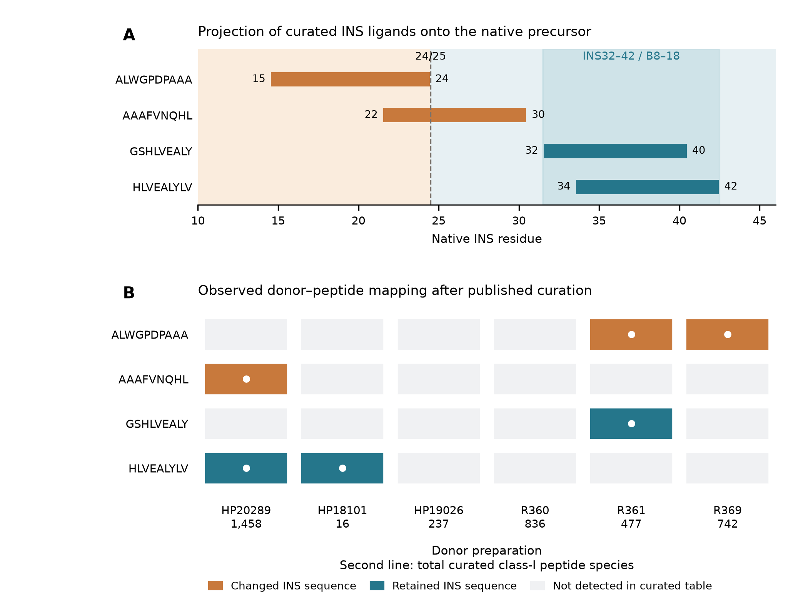
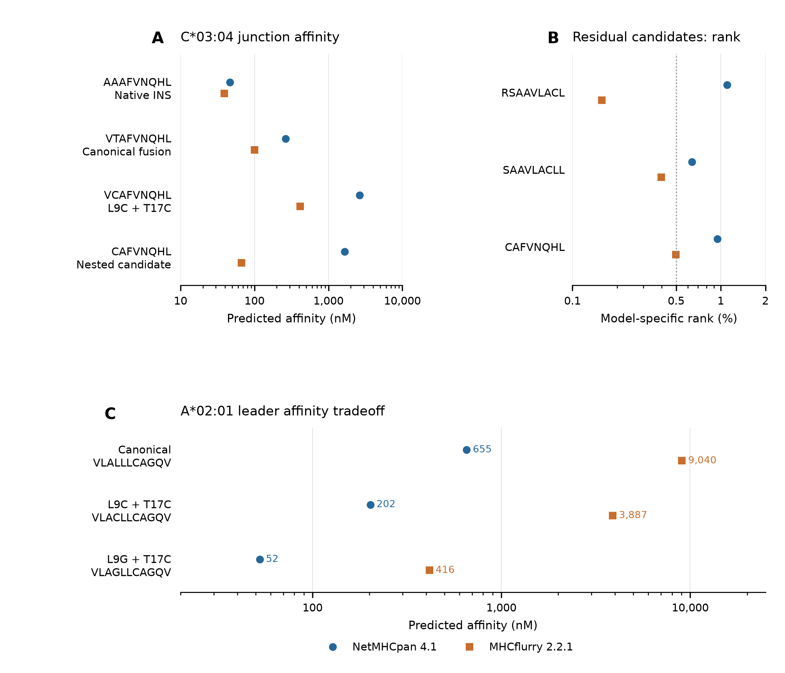

# Computational prioritization of chromogranin A signal peptide variants for engineered insulin

GloGlo Labs

Working paper | Version 1.0 | 15 September 2026

## Abstract

Kobaisi et al. experimentally demonstrated that replacing the insulin signal peptide with a chromogranin A leader can preserve insulin production while reducing recognition by a tested preproinsulin-reactive T-cell receptor [1]. Here, we extend that work through computational analysis and reanalysis of published human-islet immunopeptidomes. We reconstructed a canonical precursor from chromogranin A residues 1-18 and insulin residues 25-110, and combined sequence analysis, two HLA class I prediction systems, and signal-peptide cleavage prediction. Computational screening of 152 single substitutions and eight double substitutions identified L9C plus T17C as the only evaluated double variant that reduced predicted presentation counts without increasing any of 42 model, allele, and cutoff comparisons under both processing-context settings. At a 2% rank cutoff, predicted leader and junction counts decreased from 17 to 8 with NetMHCpan and from 27 to 14 with MHCflurry. SignalP retained the predicted cleavage boundary and proinsulin product. The reconstructed junction generated a predicted HLA-C\*03:04 ligand candidate, VTAFVNQHL, whereas donor-data mapping localized two retained insulin ligands to the B8-18 region. We performed no new laboratory experiments and have not tested the proposed variant for peptide presentation, insulin secretion, or T-cell recognition. These analyses nominate a defined leader variant and complementary targets for experimental evaluation beyond the original T-cell specificity.

## Highlights

- A reconstructed chromogranin A-insulin junction yields a specific HLA-C\*03:04 candidate.
- A two-residue leader variant lowers predicted presentation counts across two models.
- Cleavage predictions preserve the proinsulin product while binding tradeoffs remain.
- Donor ligand data localize retained insulin sequences to the B8-18 region.

## Introduction

Antigen engineering offers a way to alter individual targets of autoimmune recognition while retaining the protein functions required by pancreatic beta cells. Insulin is a particularly direct substrate for this approach because its signal peptide is removed during entry into the secretory pathway. Changes within that leader can alter the sequences available for HLA class I presentation without changing the amino-acid sequence of proinsulin. The relevant design problem therefore combines secretory processing with the repertoire of peptides that an engineered precursor may supply to different HLA alleles.

Kobaisi and colleagues replaced the native insulin signal peptide with a chromogranin A signal peptide in human beta-cell lines lacking endogenous insulin [1]. Their experiments demonstrated insulin production, processing, secretion, and activity, together with reduced recognition and killing by cells expressing the HLA-A\*02:01-restricted 1E6 T-cell receptor. Its cognate insulin signal-peptide epitope is ALWGPDPAAA, corresponding to preproinsulin residues 15-24. The result establishes that changing this leader can preserve insulin function while removing a particular target of T-cell recognition. Their study also identified the need to assess recognition by a broader autoimmune repertoire [1].

Two sequence questions follow from this experimental result. First, a replacement leader creates a new boundary with proinsulin. Peptides spanning that boundary can differ from both parental proteins, and their predicted HLA binding must be evaluated in the context of the exact fusion. Second, insulin sequences downstream of the replaced leader remain present. Published studies have identified HLA-associated insulin peptides in primary human islets and beta-cell lines, and human beta-cell killing has been demonstrated for a T-cell receptor recognizing the insulin B10-18 peptide HLVEALYLV [2-4]. A leader substitution therefore changes a specific part of the precursor rather than the complete insulin-derived target repertoire.

Existing prediction methods make these questions computationally tractable. NetMHCpan integrates binding-affinity and eluted-ligand information, while MHCflurry combines binding and antigen-processing predictions [5,6]. SignalP predicts secretory signal peptides and cleavage sites [7]. Their outputs support sequence-level comparisons, but do not directly determine T-cell recognition. In particular, agreement between binding predictions and a favorable cleavage prediction cannot establish secretion or protection from killing for a new construct.

Here, we use these resources to evaluate a canonical reconstruction of the chromogranin A-insulin precursor and to prioritize modifications within its leader. We enumerate substitutions, compare allele-specific presentation counts without combining the models' percentile scales, and inspect the individual peptides responsible for favorable and unfavorable changes. We then map the replacement onto independently published donor ligand data to identify retained insulin regions. The study produces a defined sequence candidate, a junction-specific HLA hypothesis, and a reproducible dataset linking every central comparison to its underlying predictions or published measurements.

## Results

### A canonical reconstruction defines the sequence space for analysis

We reconstructed a precursor containing human chromogranin A residues 1-18 followed directly by human insulin residues 25-110, using UniProt entries P10645 and P01308 [9]. The resulting sequence contains 104 residues: an 18-residue leader, MRSAAVLALLLCAGQVTA, followed by the unchanged 86-residue proinsulin sequence. The 18/19 cleavage boundary is consistent with supplementary Figure S2 of Kobaisi et al. [1]. The complete synthesized construct sequence was not an input to this analysis. All fusion-specific calculations are therefore conditional on the explicit reconstruction (Figure 1).

The HLA panel comprised the six classical class I alleles reported for ECN90 cells, A*02:01, A*03:01, B*40:01, B*49:01, C*03:04, and C*07:01, together with A\*24:02 as an additional sensitivity allele. All contiguous peptides of length 8-11 were evaluated in the relevant sequence regions. The primary leader and junction comparison contains 72 sequence windows per allele, or 504 peptide-window/HLA pairs per construct. Of these, 266 pairs lie wholly within the leader and 238 cross its boundary with proinsulin. A count can include nested or overlapping peptides and the same sequence on different alleles.

### The reconstructed junction generates an HLA C candidate

The native insulin boundary peptide AAAFVNQHL, preproinsulin residues 22-30, becomes VTAFVNQHL in the reconstructed precursor. The new 9mer comprises chromogranin A residues 16-18 and insulin residues 25-30. NetMHCpan predicted HLA-C\*03:04 binding at 263.22 nM and an eluted-ligand rank of 0.25%; MHCflurry predicted 99.65 nM and a presentation rank of 0.1112% when full precursor flanks were supplied (Table 1). Both models also nominated the nested 8mer TAFVNQHL, although its predicted affinities differed substantially between methods.

| Peptide   | Sequence source         | NetMHCpan affinity nM | NetMHCpan EL rank % | MHCflurry affinity nM | MHCflurry presentation rank % |
| --------- | ----------------------- | --------------------: | ------------------: | --------------------: | ----------------------------: |
| AAAFVNQHL | Native INS22-30         |                 46.38 |                0.05 |                 38.87 |                        0.0979 |
| VTAFVNQHL | Reconstructed junction  |                263.22 |                0.25 |                 99.65 |                        0.1112 |
| TAFVNQHL  | Nested junction peptide |               1175.58 |                0.27 |                 52.56 |                        0.1761 |

Table 1. Predictions for native and reconstructed boundary peptides on HLA-C\*03:04. MHCflurry presentation values use the full precursor context. Lower affinity values and percentile ranks indicate stronger predictions within each method; the two percentile scales are not interchangeable.

Neither VTAFVNQHL nor TAFVNQHL had an exact sequence match among 169,634 protein records in the UniProt human reference proteome and additional sequences, release 2026_03. The result was unchanged when isoleucine and leucine were treated as equivalent. Positive controls returned four matches for AAAFVNQHL and nine for RSAAVLALL. An exact-sequence query of IEDB returned the established control epitopes but neither reconstructed junction sequence. These searches establish absence from the checked reference snapshots, rather than absence from every possible human peptide source or T-cell repertoire.

The native 9mer was predicted to bind C*03:04 more strongly than the reconstructed 9mer by both models. Moreover, the two peptides share residues P3-P9, AFVNQHL. The result therefore identifies a changed sequence/HLA combination for investigation, without demonstrating stronger paired binding or a new T-cell specificity. Native AAAFVNQHL was present in the curated human-islet ligand data described below, but its source donor did not express C*03:04; that observation does not experimentally assign the native peptide to this allele.

Normal signal-peptide cleavage would sever either boundary-spanning sequence. An experimentally established route involving failed ER targeting can generate a cleavage-spanning HLA class I ligand from another signal-peptide-bearing protein [8]. Whether that route supplies the reconstructed insulin junction remains an empirical question. As a boundary sensitivity analysis, we also evaluated leaders of 17 and 19 residues. Their corresponding C\*03:04 candidates, QVTFVNQHL and TALFVNQHL, retained presentation ranks below 2% in both models, while their sequences and affinities changed appreciably. This dependence makes the physical construct sequence necessary for a construct-specific test.

### Substitution scanning identifies separable leader and junction contributions

We first substituted each of the 19 non-native amino acids at leader position 17 while retaining the remainder of the precursor. This position contributes to both nominated junction peptides. We compared counts at three fixed, strict percentile thresholds, less than 0.5%, 1%, and 2%, separately for each of seven alleles and two presentation methods. The resulting 42-dimensional comparison retains allele and model identity rather than pooling their ranks.

T17C was the only substitution in this position-17 screen that improved at least one of these counts without increasing another in the full-flank analysis. Across the 266 pairs whose peptide sequence contains position 17, it improved 12 comparisons and left 30 unchanged. NetMHCpan counts at the three thresholds decreased from 2/2/7 to 0/1/2; MHCflurry counts decreased from 2/4/9 to 1/1/3. The same 12 improved and 30 unchanged comparisons were obtained after expanding the set to 546 pairs whose peptide or five-residue processing flank contains the substitution.

T17C changes the junction 9mer to VCAFVNQHL. Its predicted C\*03:04 affinity weakened to 2641.96 nM in NetMHCpan and 414.01 nM in MHCflurry. The nested CAFVNQHL remained a candidate, including a MHCflurry affinity prediction of 66.51 nM. Thus, a favorable aggregate comparison did not remove all junction candidates.

The canonical precursor also contained two NetMHCpan EL-rank less than 0.5% windows wholly within the leader, at positions 1-9 and 3-11. These are disjoint from the strong junction windows at positions 16-24 and 17-24. At least two edited leader positions are therefore required to intersect all four original strong windows. This is an exact sequence-coordinate lower bound: changing a window is necessary to change its peptide sequence, but does not guarantee reduced binding. Exhaustive coordinate enumeration also showed that, at the broader EL-rank less than 2% cutoff, the only two-position sets intersecting every baseline candidate were (8,17), (8,18), (9,17), and (9,18).

We screened all 133 non-native substitutions at leader positions 3-9, the common intersection of the two strongest leader-only windows. Only L9C and L9G removed all leader-only NetMHCpan EL-rank less than 0.5% pairs. Combined with the 19 position-17 substitutions, this yielded 152 screened single substitutions. We then explicitly rescored eight double variants formed by L9C or L9G with T17C, T17G, T17D, or T17P. These combinations were shortlisted during exploratory analysis; the study did not enumerate every possible two-residue variant.

### A two residue variant reduces predicted presentation counts across the evaluated comparisons

L9C plus T17C was the only one of the eight tested double variants that improved presentation counts without worsening any of the 42 comparisons under both MHCflurry processing-context settings. With full flanks, 16 comparisons improved and 26 were unchanged. Without flanks, 15 improved and 27 were unchanged. The selected leader sequence is MRSAAVLACLLCAGQVCA; the downstream proinsulin sequence is unchanged (Figures 1 and 2).

| Prediction setting                            | Canonical leader | L9C plus T17C | Number of pairs |
| --------------------------------------------- | ---------------- | ------------- | --------------: |
| NetMHCpan EL ranks below 0.5% / 1% / 2%       | 4 / 8 / 17       | 0 / 2 / 8     |             504 |
| MHCflurry with flanks below 0.5% / 1% / 2%    | 9 / 19 / 27      | 3 / 6 / 14    |             504 |
| MHCflurry without flanks below 0.5% / 1% / 2% | 4 / 12 / 21      | 1 / 5 / 12    |             504 |
| SignalP cleavage probability at 18/19         | 0.979955         | 0.979581      |  Not applicable |

Table 2. Central comparison with the canonical reconstructed precursor. The first three rows count overlapping peptide-window/HLA pairs, not biological replicates or independently recognized T-cell epitopes. SignalP values are from the same submission batch and refer to the predicted cleavage boundary.

The L9C single-substitution control also satisfied the no-increase rule in both contexts, improving 16 comparisons with flanks and 15 without. It retained two NetMHCpan windows below 0.5% and, at 2%, had 11 NetMHCpan and 20 full-flank MHCflurry candidates, compared with eight and 14 for L9C plus T17C. The double therefore reduced additional junction-associated counts relative to a feasible single-substitution control.

At the 2% threshold, the full-flank comparison represents a reduction of 9/17, or 52.9%, in NetMHCpan candidate counts and 13/27, or 48.1%, in MHCflurry counts. These percentages describe the selected leader and junction windows. Across the full 104-residue precursor, the 2% counts decreased from 59 to 50 for NetMHCpan (15.3%) and from 72 to 59 for MHCflurry with flanks (18.1%), each over 2,674 peptide-window/HLA pairs. The unchanged downstream proinsulin sequence accounts for the smaller full-precursor reductions.

Because a mutation can affect a processing score through a peptide flank even when the peptide sequence is unchanged, we expanded the comparison to 616 pairs encompassing all potentially changed processing contexts. The same no-increase criterion held. At the 2% cutoff, expanded counts changed from 19 to 10 for NetMHCpan and from 28 to 15 for MHCflurry. Separate full-precursor checks confirmed identical threshold classifications outside all mutation-containing processing contexts.

SignalP predicted cleavage at 18/19 for the baseline and selected double variant, producing the same proinsulin sequence, INS25-110. Cleavage probabilities were 0.979955 and 0.979581, respectively. A second double variant, L9G plus T17P, retained the predicted site but lowered cleavage confidence to 0.741794. Thus, the cleavage model could distinguish a less favorable combination within this small panel, while it provided no evidence for a functional advantage of the selected variant over the canonical leader.

### Residual candidates and affinity tradeoffs remain identifiable

Three C\*03:04 peptide-window pairs remained below the MHCflurry 0.5% presentation cutoff in the selected double variant: RSAAVLACL, SAAVLACLL, and CAFVNQHL. Their MHCflurry affinity predictions were 89.77, 60.57, and 66.51 nM, respectively. NetMHCpan EL ranks for these peptides were 1.1%, 0.64%, and 0.95%. The two methods therefore disagreed about their placement relative to the strictest threshold, while both retained candidate presentation in the broader range.

The selected variant also strengthened one binding-affinity prediction. L9C changes the A\*02:01 peptide VLALLLCAGQV to VLACLLCAGQV, shifting NetMHCpan affinity from 654.57 to 202.39 nM while leaving its EL rank at 5.7%. Binding affinity was not included in the 42 presentation-count comparisons. This example demonstrates why the criterion must be described as lower presentation counts rather than uniformly weaker binding (Figure 4).

Alternative combinations exposed larger cross-allele changes. L9G created VLAGLLCAGQV, predicted by NetMHCpan to bind A*02:01 at 52.49 nM with an EL rank of 1.2%. In L9C plus T17D, junction peptides crossed the 2% EL threshold on A*02:01, B*40:01, and B*49:01. Inspection of these individual transitions explains why a variant with a low pooled count at one threshold need not provide the preferred multi-allele comparison (Figure 2).

The no-increase result also depends on the chosen percentile thresholds. At a strict 3% MHCflurry presentation cutoff without flanks, the HLA-A\*03:01 count increases from zero to one: baseline QVTAFVNQH has rank 4.7322%, whereas the aligned candidate QVCAFVNQH has rank 2.9106%. Thus, the selected double passes the reported 0.5%, 1%, and 2% comparisons but does not dominate the baseline at every threshold.

### Public donor data localize insulin ligands retained by leader replacement

We projected the leader replacement onto the curated class I ligand list from six non-diabetic, cytokine-treated human-islet donor preparations reported by Nanaware et al. [3]. These measurements were obtained from mixed islets, rather than purified beta cells. Four donors had curated insulin peptides, yielding six donor-peptide observations and four distinct insulin sequences. Two sequences, ALWGPDPAAA and AAAFVNQHL, intersect the native signal peptide and are changed by the reconstruction. The other two, HLVEALYLV and GSHLVEALY, remain present verbatim (Figure 3).

HLVEALYLV maps to preproinsulin residues 34-42, equivalent to insulin B10-18, and was observed in donors HP20289 and HP18101. GSHLVEALY maps to residues 32-40, equivalent to B8-16, and was observed in R361. Together they define a retained region spanning preproinsulin residues 32-42, or insulin B8-18, across three of four insulin-positive donors. This is a sequence-retention annotation of published measurements; presentation was not measured after engineering.

The identity of the two retained species and their shared region persisted when an explicitly zero same-peptide blank was required and after excluding the lowest-depth donor. The fraction of insulin-positive donors containing a retained ligand changed from 3/4 to 2/3 under each of those sensitivity analyses. Removing positive blank observations while retaining unknown blanks preserved the 3/4 fraction. We used the authors' curated ligand list because the unfiltered hormone-elution table contained class I channel signal for 103 distinct insulin strings, many of which were excluded during their background assessment. Treating all such signals as presented ligands would greatly expand the apparent target repertoire.

HLVEALYLV has previous experimental support as a target of an HLA-A\*02:01-restricted, human-beta-cell-killing T-cell receptor [2]. We therefore do not identify a new epitope through this projection. The analysis connects an established functional target and an additional measured ligand to the sequence region retained by the engineering strategy.

An independent ECN90 dataset from Carré et al. [4] provided context for this retained region under interferon-alpha exposure. HLVEALYLV was detected in all four replicates in both basal and stimulated conditions. Its source-summary signal increased 11.25-fold in the main experiment and 1.44-fold in an independent experiment. The direction of change agreed, but the magnitude did not closely replicate. A discrepancy between worksheets reporting the original signal-peptide target was retained in the data audit and excluded from a precise relative-induction claim.

## Discussion

The experimental demonstration that a chromogranin A leader can support functional insulin production creates an opportunity for sequence-level refinement [1]. Our analysis identifies a concrete two-residue candidate within that leader and specifies the comparisons supporting its selection. The result depends on a canonical reconstruction, seven HLA alleles, two existing prediction systems, and a bounded substitution panel. Within that setting, L9C plus T17C reduced candidate presentation counts across both processing-context settings and retained the predicted cleavage boundary.

The spatial separation of the original strong leader and junction windows explains why a two-position design is useful. One substitution can affect the amino-terminal leader candidates while another changes peptides crossing into proinsulin. This observation is more informative than selecting a variant by the lowest pooled score: it connects the chosen coordinates to distinct parts of the precursor and identifies the windows that remain. Explicit rescoring of the double substitutions was essential because some peptides or processing flanks can include both edited positions, making independent addition of single-substitution effects inappropriate.

The comparison also illustrates the limits of aggregate prediction metrics. The selected variant reduces the number of windows below the fixed presentation thresholds yet strengthens an A\*02:01 binding-affinity prediction. Other variants exchange favorable C-locus changes for new A- or B-locus candidates. Keeping allele-specific counts, individual peptide scores, and processing-context settings separate preserves these tradeoffs. The approximate halving of counts is consequently a description of this sequence screen, rather than a measure of additional immune escape.

The junction candidate addresses a different experimental question from the retained insulin region. VTAFVNQHL is a sequence-specific hypothesis about the reconstructed fusion and an HLA-C allele already present in ECN90. Its absence from the searched proteome and IEDB snapshot does not establish an untolerized T-cell surface: much of the 9mer is shared with its native counterpart, and no corresponding T-cell response was measured. By contrast, HLVEALYLV is an established functional target whose sequence survives leader replacement. The donor projection therefore prioritizes a complementary challenge to the original 1E6 assay, without implying that the peptide itself was newly discovered.

These analyses support a focused experimental comparison after the actual construct sequence is established. The canonical leader and L9C plus T17C can be compared for presentation of the nominated junction and residual leader peptides, alongside insulin processing and function. Recognition of the retained B10-18 target would test a sequence outside the edited leader. Such a comparison would distinguish three outcomes that the present calculations separate explicitly: removal of a particular peptide sequence, reduced peptide presentation, and reduced recognition by a cognate T-cell receptor.

### Limitations of the study

The complete physical fusion sequence was not an input to this analysis, and a one-residue difference in leader length changes the nominated junction sequences. The present calculations therefore describe the canonical reconstruction, not a sequence-verified analysis of the laboratory reagent. The search also omits many possible substitutions, other leader sequences, noncanonical translation products, modified peptides, and peptides outside the 8-11-residue range. The seven-allele panel was chosen for the cellular system with one additional allele and was not weighted to estimate population coverage.

The 42-comparison rule was introduced as an audit during exploratory analysis, not preregistered before candidate selection. The cutoffs are fixed for the reported comparisons but do not confer uniform superiority at every possible threshold. The predictors can share training data and their agreement is not an independent biological replication. The signal-cleavage prediction does not test the effects of the introduced cysteines on ER entry, folding, secretion, cellular stress, or insulin activity. Native chromogranin A also remains a separate peptide source when only the engineered insulin precursor is changed.

The donor analysis uses a small set of non-diabetic, inflamed mixed-islet preparations and a source-specific curation procedure. A retained sequence need not be presented at the same abundance after engineering, and inferred HLA assignments in mixed-allele samples are not equivalent to monoallelic validation. No new experiments on cells, animals, or T cells were performed. These constraints define the immediate contribution: an auditable computational candidate and a small set of specific experimental comparisons.

## Methods

### Resource summary

| Resource                         | Role                                   | Identifier or version                    |
| -------------------------------- | -------------------------------------- | ---------------------------------------- |
| Human insulin and chromogranin A | Reference precursor sequences          | UniProt P01308 and P10645                |
| Human reference proteome         | Exact sequence audit                   | UP000005640, release 2026_03             |
| Human-islet ligand tables        | Donor footprint analysis               | Nanaware et al., Tables S4 and S5 [3]    |
| ECN90 source data                | Interferon-alpha context               | Carré et al., source data [4]            |
| NetMHCpan                        | Affinity and eluted-ligand prediction  | BA 4.1 and EL 4.1 [5]                    |
| MHCflurry                        | Affinity, processing, and presentation | Code 2.2.1, model distribution 2.2.0 [6] |
| SignalP                          | Signal peptide and cleavage prediction | 6.0, fast, eukaryotic mode [7]           |
| IEDB query service               | Exact epitope sequence audit           | Public API snapshot, 15 September 2026   |

### Study design and source materials

This was an exploratory computational study using public reference sequences, published supplementary datasets, and newly generated prediction outputs. No participants were recruited and no new human materials or experimental organisms were used. Biological sample information refers only to the cited source studies. The donor projection included all six preparations in the authors' curated class I dataset, including preparations without curated insulin peptides; no donor was excluded from the primary analysis because of its insulin result. The primary analysis unit was a peptide-window/HLA pair for prediction comparisons and a donor-peptide observation for the islet projection.

### Sequence reconstruction and coordinate conventions

Canonical sequences were retrieved as UniProt JSON records and stored with their provenance. Insulin residues 1-24 were treated as the native signal peptide and residues 25-110 as proinsulin. The reconstructed precursor was chromogranin A residues 1-18 concatenated with insulin residues 25-110. Variant names use chromogranin A leader coordinates: L9C and T17C refer to residues 9 and 17 of that 18-residue leader, not to positions in native insulin. All full precursor sequences and the shorter sequence contexts submitted to prediction services were archived.

We enumerated every contiguous 8-, 9-, 10-, and 11-residue window. Leader and junction analyses retained windows beginning at reconstructed precursor positions 1-18; the latest possible endpoint was position 28. A 29-residue amino-terminal context therefore covered all these windows for NetMHCpan requests. Comparisons were keyed by construct, HLA allele, start, end, and peptide sequence. An additional analysis included windows beginning through position 22 to capture the effect of a position-17 substitution within a five-residue amino-terminal processing flank. Full-precursor MHCflurry predictions allowed direct verification beyond this affected region.

### Variant enumeration and selection

The initial junction scan contained the native threonine and each of the 19 substitutions at leader position 17. The leader scan comprised 19 substitutions at each of positions 3-9, producing 133 additional single variants. The two scans therefore represented 152 distinct single substitutions. A coordinate-only hitting-set analysis enumerated the minimum leader-position sets intersecting all canonical candidate windows at each NetMHCpan EL cutoff. This calculation determined sequence coverage and did not use an assumed reduction in binding after a hit.

Eight double variants combined residue 9 choices C or G with residue 17 choices C, G, D, or P. The final prediction batch also included five controls, the baseline and the L9C, L9G, T17C, and T17G single variants, giving 13 constructs. The double variants were predicted directly rather than calculated by adding single-variant changes. Candidate shortlisting, cross-model comparison, and the 42-objective audit occurred during exploration. The analysis does not estimate performance on an independently selected test set.

### HLA prediction and processing context

NetMHCpan predictions were obtained through the official IEDB class I API using methods netmhcpan_ba-4.1 and netmhcpan_el-4.1 [11]. Both heads belong to the same predictor system. Request manifests record the input sequences, alleles, lengths, response status, and response hashes. Failed requests were treated as missing outputs and retried in smaller batches when necessary; they were never coded as negative predictions. Grid completeness and sequence-coordinate agreement were checked before deriving counts.

MHCflurry code version 2.2.1 used the published class I presentation models dated 20200611, distributed under model release 2.2.0. Predictions ran locally on CPU, with the model files and dependency versions recorded. Each HLA allele in the panel was supported by the installed model. Affinity, affinity percentile, processing score, presentation score, and presentation percentile were retained. We generated predictions with the actual five-residue amino- and carboxy-terminal flanks available in the complete precursor, and separately without flanks. Flanks were truncated naturally at precursor termini. The positions 3-9 single-substitution screen used 33-residue prefixes, sufficient to supply complete five-residue flanks for every reported leader and junction window. The position-17 and final double-variant analyses used complete 104-residue sequences in both modes.

NetMHCpan eluted-ligand rank and MHCflurry presentation percentile were the two presentation endpoints. Binding affinities were retained as a separate descriptive endpoint. Lower predicted affinity values in nM and percentile ranks indicate stronger predictions within each method. Values on different rank scales were not averaged, and neither model output was converted to a probability of T-cell recognition.

### Count objectives and sensitivity analysis

Let C(v,m,a,t) denote the sum, over the specified peptide windows in variant v, of the indicator that model m returns a percentile below threshold t for allele a. We compared C(v,m,a,t) with the corresponding baseline count for each combination. For each construct, presentation method, HLA allele, and threshold, we counted the selected peptide-window/HLA pairs whose returned percentile rank was strictly below the threshold. Thresholds were 0.5%, 1%, and 2%, applied to the returned numerical values without rounding them further. Seven alleles, three thresholds, and two methods yielded 42 counts for each processing-context comparison. A variant met the no-increase criterion if every count was less than or equal to its baseline counterpart and at least one was lower. The with-flank and without-flank comparisons were evaluated separately, with the same NetMHCpan counts in both.

Primary counts used 504 leader and junction pairs per construct. The full context sensitivity comparison included 616 pairs. For NetMHCpan windows beyond the 29-residue request context, values were reused from the full canonical-precursor scan only after exact peptide identity was verified; MHCflurry values came from full variant precursors. The position-17-only analysis separately used 266 mutation-containing pairs and 546 pairs with a mutation in the peptide or its processing flanks. We also inspected individual baseline-to-variant threshold crossings, retained unthresholded affinity and presentation outputs, and examined threshold sensitivity beyond the three reported cutoffs. A favorable result at the fixed cutoffs was not interpreted as superiority over all thresholds.

### Signal peptide analysis

SignalP 6.0 was run through its official public web interface in eukaryotic fast mode. The first batch contained native insulin and the 20 position-17 choices including the canonical reconstruction. A second batch contained native insulin, the reconstruction, six single-variant controls, and all eight double variants. Exact input FASTA records, result files, and job identifiers were retained. For each sequence, we recorded the predicted cleavage boundary and its reported probability, then reconstructed the predicted product after cleavage. These products were compared directly with INS25-110. Same-batch baseline and variant probabilities were used for the central table.

### Reference proteome and epitope sequence searches

The reference audit used the official UniProt human reference proteome FASTA and its additional-sequence FASTA for release 2026_03. Both downloads were verified against the release manifest before parsing. The combined dataset contained 169,634 records. Exact matching was performed for the nominated 9mers and nested 8mers, with a second pass treating I and L as equivalent. Known native insulin and chromogranin A sequences served as positive controls. Counts represent matching protein records, not independent genomic loci.

IEDB was queried by exact epitope sequence without a diabetes-specific filter, with control epitopes included in the same audit [10]. Responses and query provenance were cached on 15 September 2026. No-hit results were interpreted only within those reference snapshots. The searches did not cover every unannotated open reading frame, post-translational modification, individual genetic variant, or cross-reactive T-cell receptor.

### Donor immunopeptidome projection

We read the class I sheet of Nanaware et al. Table S5 and matched insulin and chromogranin A entries against the hormone-specific sheets of Table S4 [3]. The curated class I input contained 3,766 donor-peptide rows. Sequence coordinates were checked against canonical proteins, and each selected curated observation was required to match exactly one hormone-table observation from the same donor. The main analysis retained the authors' curated selection rather than rebuilding a ligand list from all raw hormone-channel signals.

Insulin peptides ending by position 24 were classified as lying within the native signal peptide; those starting at or before 24 and ending after 24 crossed the boundary; those starting at position 25 or later were classified as downstream. Exact sequence presence in the reconstructed precursor was then verified. Donor summaries included all six preparations. Separate sensitivity analyses removed positive same-peptide blank matches while retaining unknown blanks, required an explicitly zero same-peptide blank while excluding unknown blanks, removed overlap of at least six consecutive residues with a same-gene, same-donor positive blank peptide, and excluded HP18101, the donor with the fewest curated class I peptides (16). All reported fractions use the insulin-positive donor count for the corresponding analysis. Sequence retention was not interpreted as a measured post-engineering ligand abundance.

### Inflammatory context from ECN90 data

Published ECN90 peptide-detection and quantitative source workbooks from Carré et al. were joined by peptide sequence [4]. We annotated conventional insulin peptides by the same leader, boundary, and downstream coordinate rules. Detection support was retained as the number of positive biological replicates out of four. Ratios for HLVEALYLV were calculated from the authors' quantitative source summaries: the main four-replicate summary and an independent three-replicate median summary were reported separately. We did not pool experiments or use the disparate effect sizes to estimate a common fold change. Conflicting worksheet values for the original signal-peptide target were documented and were not resolved by selecting the value most favorable to the proposed design.

### Quantification and statistical analysis

The substitution scans are deterministic comparisons conditional on the input sequences and trained predictors. Peptide windows overlap, HLA predictions are correlated, and the model runs are not biological replicates. We therefore report complete counts, exact score changes, and sensitivity checks without inferential P values or confidence intervals computed from peptide windows. The donor analysis is descriptive, with denominators and source-specific exclusions stated explicitly. No statistical test of disease association or engineering efficacy was performed.

Validation checked complete peptide/HLA grids, unique keys, sequence-coordinate agreement, baseline consistency across submissions, unchanged proinsulin sequences, and processing flanks. Independent parsers reconstructed central counts from raw tables. Full-precursor comparisons used numerical tolerances of 1e-5 relative and 1e-7 absolute for repeated floating-point outputs; the fixed-threshold classifications outside changed processing contexts were identical. Cached-data scripts were executed in an extracted package to test reproduction without model downloads or new network submissions.

### Use of generative AI

Codex-based AI agents were used for literature retrieval, analysis design, software development, execution and checking of computational analyses, figure-code generation, and manuscript drafting. HLA and signal-peptide values were obtained from the named prediction systems; donor observations were extracted from the cited experimental datasets. Numerical validation used executable scripts and saved outputs. The AI workflow did not generate biological measurements, and the computational checks do not constitute external peer review or human author approval.

## Resource availability

### Materials availability

This study generated sequence designs and computational outputs. No physical constructs, cell lines, or other biological reagents were generated.

### Data and code availability

The accompanying research package contains construct sequences, peptide-level predictions, derived donor mappings, figure source data, data dictionaries, provenance records, and executable analysis scripts. The original public datasets and predictor resources are identified by their source URLs, versions, and checksums. Installed software environments, model weights, and publisher article files are excluded from the shareable package. The cached-analysis entry point reproduces the central comparisons without new prediction submissions. The complete study is available at [github.com/gloglolabs/research](https://github.com/gloglolabs/research/tree/main/studies/2026/chga-ins-leader). From a fresh repository checkout, `python3 scripts/verify.py` verifies input checksums and compares every regenerated result CSV with the published reference. The study directory contains the manuscript source, figure source tables and plotting scripts. Original code is MIT-licensed; original reports and generated research data are CC BY 4.0, with third-party materials retaining their own terms. The exact software and data snapshot is identified by the repository commit associated with this paper.

## References

1. Kobaisi F, Oshima M, Zhou Z, Thibaut D, Kobaisi A, Brandao B, Mallone R, Scharfmann R (2026). Engineering the insulin signal peptide to protect human pancreatic beta cells from autoimmune destruction. Cell Rep 45, 117941. [doi:10.1016/j.celrep.2026.117941](https://doi.org/10.1016/j.celrep.2026.117941)

2. Whalley T, Dolton G, Brown PE, Wall A, Wooldridge L, van den Berg H, Fuller A, Hopkins JR, Crowther MD, Attaf M, et al. (2020). GPU-Accelerated Discovery of Pathogen-Derived Molecular Mimics of a T-Cell Insulin Epitope. Front Immunol 11, 296. [doi:10.3389/fimmu.2020.00296](https://doi.org/10.3389/fimmu.2020.00296)

3. Nanaware PP, Calvo-Calle JM, Redick SD, Tarpley MW, Cruz J, Clement CC, Manganaro A, Velarde de la Cruz EE, Muneeruddin K, Faulkner M, et al. (2025). The antigen presentation landscape of cytokine-stressed human pancreatic islets. Cell Rep 44, 115927. [doi:10.1016/j.celrep.2025.115927](https://doi.org/10.1016/j.celrep.2025.115927)

4. Carré A, Samassa F, Zhou Z, Perez-Hernandez J, Lekka C, Manganaro A, Oshima M, Liao H, Parker R, Nicastri A, et al. (2025). Interferon-α promotes HLA-B-restricted presentation of conventional and alternative antigens in human pancreatic β-cells. Nat Commun 16, 765. [doi:10.1038/s41467-025-55908-9](https://doi.org/10.1038/s41467-025-55908-9)

5. Reynisson B, Alvarez B, Paul S, Peters B, Nielsen M (2020). NetMHCpan-4.1 and NetMHCIIpan-4.0: improved predictions of MHC antigen presentation by concurrent motif deconvolution and integration of MS MHC eluted ligand data. Nucleic Acids Res 48, W449-W454. [doi:10.1093/nar/gkaa379](https://doi.org/10.1093/nar/gkaa379)

6. O'Donnell TJ, Rubinsteyn A, Laserson U (2020). MHCflurry 2.0: Improved Pan-Allele Prediction of MHC Class I-Presented Peptides by Incorporating Antigen Processing. Cell Syst 11, 42-48.e7. [doi:10.1016/j.cels.2020.06.010](https://doi.org/10.1016/j.cels.2020.06.010)

7. Teufel F, Almagro Armenteros JJ, Johansen AR, Gíslason MH, Pihl SI, Tsirigos KD, Winther O, Brunak S, von Heijne G, Nielsen H (2022). SignalP 6.0 predicts all five types of signal peptides using protein language models. Nat Biotechnol 40, 1023-1025. [doi:10.1038/s41587-021-01156-3](https://doi.org/10.1038/s41587-021-01156-3)

8. Schlosser E, Otero C, Wuensch C, Kessler B, Edelmann M, Brunisholz R, Drexler I, Legler DF, Groettrup M (2007). A novel cytosolic class I antigen-processing pathway for endoplasmic-reticulum-targeted proteins. EMBO Rep 8, 945-951. [doi:10.1038/sj.embor.7401065](https://doi.org/10.1038/sj.embor.7401065)

9. UniProt Consortium (2025). UniProt: the Universal Protein Knowledgebase in 2025. Nucleic Acids Res 53, D609-D617. [doi:10.1093/nar/gkae1010](https://doi.org/10.1093/nar/gkae1010)

10. Vita R, Blazeska N, Marrama D, Duesing S, Bennett J, Greenbaum J, De Almeida Mendes M, Mahita J, Wheeler DK, Cantrell JR, et al. (2025). The Immune Epitope Database (IEDB): 2024 update. Nucleic Acids Res 53, D436-D443. [doi:10.1093/nar/gkae1092](https://doi.org/10.1093/nar/gkae1092)

11. Yan Z, Kim K, Kim H, Ha B, Gambiez A, Bennett J, de Almeida Mendes MF, Trevizani R, Mahita J, Richardson E, et al. (2024). Next-generation IEDB tools: a platform for epitope prediction and analysis. Nucleic Acids Res 52, W526-W532. [doi:10.1093/nar/gkae407](https://doi.org/10.1093/nar/gkae407)

## Figures

### Figure 1 Sequence architecture and computational search design

**A**, Canonical human INS and the reconstructed CHGA1–18/INS25–110 fusion, with the L9C + T17C candidate beneath. Bars are proportional to precursor length; numbers above the boundaries denote cleavage positions. All fusion constructs retain the complete proinsulin sequence INS25–110. **B**, Sequence alignment anchored at the signal/proinsulin boundary, with substitutions at CHGA residues 9 and 17 highlighted. The six-residue indentation reflects the shorter CHGA signal. **C**, Search stages. Substitution counts exclude their controls: 19 choices at position 17 and 133 substitutions at positions 3–9 precede eight explicit combinations. Seven HLA alleles, two presentation models and three fixed rank cutoffs define 42 count criteria. Architectures are canonical sequence reconstructions; the synthesized construct sequence in Kobaisi et al. was not an input to this analysis [1].

### Figure 2 Allele resolved evaluation of all eight double substitutions

**A, B**, Changes from the canonical CHGA–INS baseline in qualifying peptide/HLA-window counts for NetMHCpan EL and MHCflurry presentation with full flanks. Each allele has strict 0.5%, 1% and 2% rank cutoffs. Blue denotes fewer candidates, orange denotes more, and unnumbered gray cells denote zero change. **C**, Improved, unchanged and worsened criteria among the 42 comparisons, with full flanks in the upper bar and no flanks in the lower hatched bar. L9C + T17C improves 16/42 criteria with full flanks and 15/42 without flanks, with no worsening in either context. **D**, Baseline and selected-variant totals, shown separately for each model/context. Each total uses 504 overlapping peptide/HLA windows; these are computational counts, not independent biological observations. Percentile scales are model-specific and were not pooled.

### Figure 3 Donor resolved projection identifies retained insulin sequences

**A**, Four distinct INS ligands from six non-diabetic, cytokine-treated mixed-islet donor preparations in Nanaware et al.'s curated class-I table [3], mapped to canonical INS coordinates. The dashed line marks the native signal/proinsulin boundary. Orange sequences change in the canonical signal replacement; teal sequences retain their amino-acid sequence. The retained GSHLVEALY and HLVEALYLV intervals fall within INS32–42, corresponding to insulin B8–18. **B**, Exact donor–peptide detections: six observations across four INS-positive preparations among six preparations examined. The two retained peptides occur in three of the four INS-positive preparations. Gray cells indicate absence from the curated table, not demonstrated biological absence. Numbers beneath donor identifiers give total curated class-I peptide species and reveal unequal detection depth. No peptide intensity was pooled across donors. Predicted HLA assignments in the source table are not treated as experimentally demonstrated restrictions here.

### Figure 4 Cross model predictions reveal retained candidates and affinity tradeoffs

**A**, HLA-C*03:04 affinity predictions for the native INS junction, canonical fusion junction, selected double variant and its nested 8mer. The native AAAFVNQHL peptide is predicted to bind more strongly than reconstructed VTAFVNQHL. **B**, The three L9C + T17C candidates below the MHCflurry 0.5% presentation-rank cutoff: RSAAVLACL, SAAVLACLL and CAFVNQHL, all shown for C*03:04. The dotted line marks 0.5%; NetMHCpan EL and MHCflurry presentation ranks remain separate model estimates. **C**, An A*02:01 affinity tradeoff: the selected candidate's VLACLLCAGQV is predicted to bind more strongly than native VLALLLCAGQV, while the L9G + T17C alternative produces a larger shift. Lower nM values correspond to tighter predicted binding. Points are individual model outputs, not replicate measurements or uncertainty estimates; presentation-count improvement does not imply uniformly weakened affinity.

